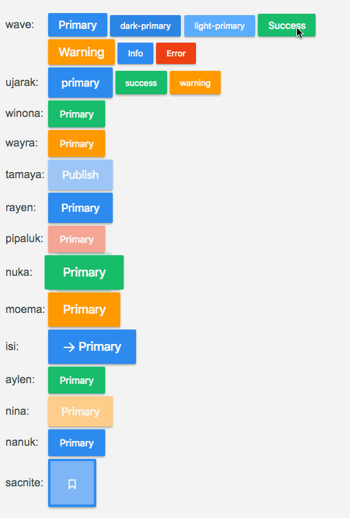

 # vue-button-effect

> A Vue.js 2.0 Button Effect Plugin for Web.

> 为Vue设计的特效按钮插件



## Browser Support

Modern browsers and Internet Explorer 10+

## Install

```bash
npm install vue-button-effect -S
```

## Quick Start
```vue

// main.js
import vueButtonEffect from 'vue-button-effect'
Vue.use(vueButtonEffect)

<template>
  <g-button-wave color="primary" size="button--size-m">Primary</g-button-wave>
	...
	...
	...

</template>

<script>
export default {
  data () {
    return {
      
    }
  }
}
</script>

```


## API

| Button标签\<n\>\</n\>                                        |
| ------------------------------------------------------------ |
| g-button-wave&nbsp;&nbsp;&nbsp;&nbsp;g-button-ujarak&nbsp;&nbsp;&nbsp;g-button-winona&nbsp;&nbsp;&nbsp;g-button-wayra&nbsp;&nbsp;&nbsp;g-button-tamaya&nbsp;&nbsp;&nbsp;&nbsp;g-button-rayen<br>g-button-pipaluk&nbsp;&nbsp;&nbsp;g-button-nuka&nbsp;&nbsp;&nbsp;g-button-moema&nbsp;&nbsp;&nbsp;&nbsp;g-button-isi&nbsp;&nbsp;&nbsp;g-button-aylen&nbsp;&nbsp;&nbsp;g-button-nina<br>g-button-nanuk&nbsp;&nbsp;&nbsp;&nbsp;g-button-sacnite |

| 参数（属性） | 描述       | 类型   | 默认值          | 示例                  |
| ------------ | ---------- | ------ | --------------- | --------------------- |
| color        | button颜色 | String | -               | color="primary"       |
| size         | button大小 | String | button--size-ss | size="button--size-m" |


## license

MIT

